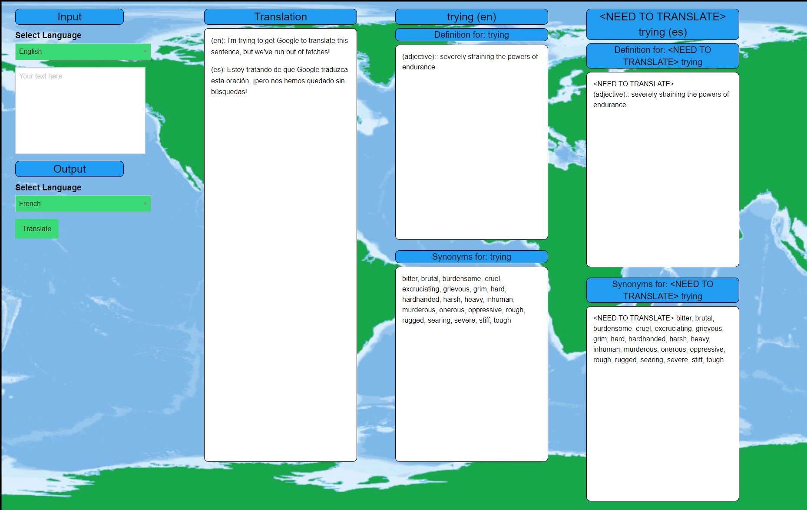

# World Traveler Dictionary and Translation App
## UW Coding Bootcamp, Group Project #1

## Assignment Description
This is a CSS/HTML/Javascript *group project* for the UW Bootcamp. The goal of the assignment has been chosen and agreed upon by the group: to create a single web page application that is able to fetch, parse, and display data from two separate `CORS` enabled API's. A new front end framework is to be learnt and used (`Foundation`). 

This project stresses equal importance between project management and web development.
A development process shall be identified and agreed upon to push and pull code to GitHub.

A mockup / wireframe shall be created by an individual within the project team and used as a visual goal.

A project user story and acceptance criteria shall be created by an individual within the project team and used as a functionality goal.

Project management shall be `Agile` and augmented with `Kanban`: with individual tasks divided, assigned, and tracked.

## Project Scope
Create a single web page application that allows a user to input and translate any sentence into a desired language.
Words may then be individually clicked on to obtain their respective definitions and synonyms.

A previous translate history with access to `localStorage` shall be considered. 

No HTML, CSS, or Javascript starting code has been provided.
No guidance, project choices, or project direction has been provided.

## Generalized Tasks
Web Development Tasks:
- Use the Foundation front-end framework and populate the DOM with: buttons and text areas in an organized layout
- Write javascript functions to handle Google Translate API fetch operations (pull, `JSON` parse, write to the DOM, and save data)  
- Write javascript functions to handle Merriam-Webster API fetch operations (pull, `JSON` parse, write to the DOM and save data)
- Use `Buttons` and `listenerEvents` to add web app functionality and responsiveness
- Use `@media queries` to add project screen adaptability and responsiveness
- Store translate history in `localStorage`

Project Management Tasks:
- Create a wireframe goal for the web app
- Identify and divide tasks among group members 
- Develop a process to cleanly push and pull code to GitHub to reduce merge conflicts 
- Check in with group members and communicate changes and problems

## View the project

Navigate to the World Traveler Dictionary and Translation App in [GitHub Pages](https://github.com/levisgaragegroupinc/translation_app) to view the live web app! 

## Summary of Work Completed

## List of Files
* README.md - This current read me file
* index.html - HTML file for the single web page app (`Foundation Framework`)
* ~./assets/css/style.css - CSS files for generalized appearance (`Foundation Framework`)
* ~./assets/js/javascript.js - Javascript file containing functionality (`JQuery`)
* ~./assets/images/... Various image files showcasing functionality (`PNG`)

# General Project Details (Translation App)

## User Story (Project Scope)

```
AS A tourist
I WANT to translate sentences into other languages and see the definition or synonyms for individual words
SO THAT I can more fully enjoy my travels
```

## Acceptance Criteria (Project Scope)

```
GIVEN a language dashboard with textarea inputs and dropdowns
WHEN I select an input language
THEN I am able to type in a sentence to translate
WHEN I select an output language from the dropdown and press a "translate button"
THEN I am presented with the input sentence and the translated sentence in that selected language
WHEN I refresh the page
THEN I am able to view the last few translated sentences and their english counterparts
WHEN I click on an English word in the output box
THEN I am presented with the definition to that word and it's synonyms
```

## URL to the GitHub Repository

[GitHub Pages Link: https://github.com/levisgaragegroupinc/translation_app](https://github.com/levisgaragegroupinc/translation_app)

## Original Wireframe


## Screenshot of the finished App, General Appearance



## Credits

This project uses:

 - Figma Wireframe Kit: [Figma](https://www.figma.com/templates/wireframe-kits/)
 - Foundation Front End Framework: [Foundation](https://get.foundation/index.html)
 - JQuery JavaScript Library: [JQuery](https://jquery.com/)
 - GoogleTranslate API: [GoogleTranslate](https://rapidapi.com/googlecloud/api/google-translate1/)
 - Merriam-Webster's Collegiate® Dictionary with Audio: [Merriam-Webster's Dictionary](https://dictionaryapi.com/products/api-collegiate-dictionary)
 - Merriam-Webster's Collegiate® Thesaurus: [Merriam-Webster's Thesarus](https://dictionaryapi.com/products/api-collegiate-thesaurus)

## License
MIT License

Copyright (c) [2022] [Travis Bates, Tiffany Dempsey, Wonjong Park, Vladimir Berka]

Permission is hereby granted, free of charge, to any person obtaining a copy
of this software and associated documentation files (the "Software"), to deal
in the Software without restriction, including without limitation the rights
to use, copy, modify, merge, publish, distribute, sublicense, and/or sell
copies of the Software, and to permit persons to whom the Software is
furnished to do so, subject to the following conditions:

The above copyright notice and this permission notice shall be included in all
copies or substantial portions of the Software.

THE SOFTWARE IS PROVIDED "AS IS", WITHOUT WARRANTY OF ANY KIND, EXPRESS OR
IMPLIED, INCLUDING BUT NOT LIMITED TO THE WARRANTIES OF MERCHANTABILITY,
FITNESS FOR A PARTICULAR PURPOSE AND NONINFRINGEMENT. IN NO EVENT SHALL THE
AUTHORS OR COPYRIGHT HOLDERS BE LIABLE FOR ANY CLAIM, DAMAGES OR OTHER
LIABILITY, WHETHER IN AN ACTION OF CONTRACT, TORT OR OTHERWISE, ARISING FROM,
OUT OF OR IN CONNECTION WITH THE SOFTWARE OR THE USE OR OTHER DEALINGS IN THE
SOFTWARE.